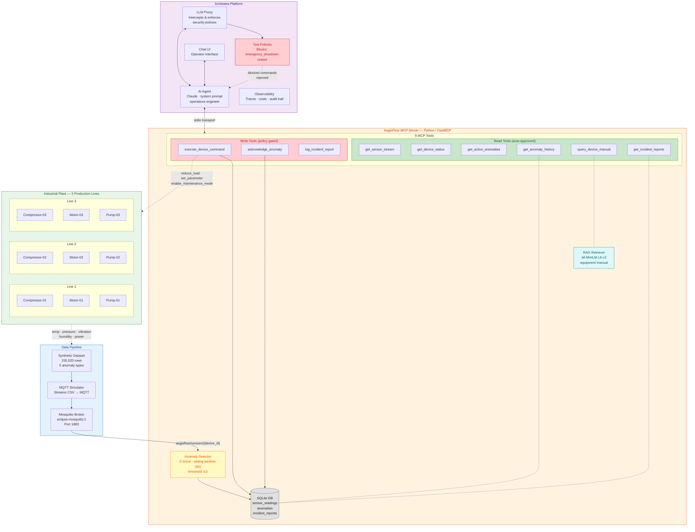

# AegisFlow — Real-Time IoT/OT Monitoring with AI Guardrails

AegisFlow is an AI agent system for industrial IoT monitoring that bridges real-time sensor streams and LLM-powered diagnosis — with physical safety guardrails enforced through Archestra's Dynamic Tools.

---

## The Problem

Industrial IoT environments generate **massive, continuous sensor data streams** across dozens of devices. Connecting an LLM directly to this data is impractical:

1. **Context window saturation** — 9 devices × 17,280 readings/day × 5 sensors = 777,600 data points per day. You can't dump this into a prompt.
2. **Dangerous autonomy** — Letting an AI control physical equipment without guardrails is a safety incident waiting to happen. A hallucinated `emergency_shutdown` command can cost $50,000/hour in downtime. A missed one can cause fires.
3. **No memory** — Each LLM call starts fresh. Without institutional memory, the agent can't recognize recurring failure patterns or learn from past incidents.

---

## Architecture



### Data Flow

```
Sensor CSV ──► MQTT Simulator ──► Mosquitto Broker ──► Anomaly Detector
                                                              │
                                              Z-score breach? │
                                                    ┌─────────┘
                                                    ▼
                  Archestra Chat UI ◄──► AI Agent ──► MCP Tools
                       │                    │            │
                       │              LLM Proxy     ┌────┴────┐
                       │              (security)    │ SQLite  │
                       │                   │        │ RAG     │
                       │            Tool Policies   └─────────┘
                       │            (blocks unsafe
                       ▼             commands)
                   Operator
                   Approval
```

---

## Archestra Features Used

| Feature | How AegisFlow Uses It |
|---------|----------------------|
| **LLM Proxy** | It intercepts, analyzes, and modifies LLM requests and responses to enforce security policies |
| **Private MCP Registry** | AegisFlow registered as a custom server with 9 tools |
| **Tool Policies** | `emergency_shutdown` and `restart` blocked at proxy level — agent must use safer commands like `reduce_load` |
| **Chat UI** | Operator interface for monitoring, approving commands, and querying plant status |
| **Costs & Limits** | Per-diagnosis token cost tracking; budget guardrails per tool |
| **Observability** | Full trace: sensor reading → Z-score detection → LLM diagnosis → command approval → execution |

---

## Quick Start

### Prerequisites
- Docker
- Local Archestra instance

### 1. Start the MQTT broker

```bash
docker run -d --name mosquitto \
  -p 1883:1883 \
  -v ./mosquitto.conf:/mosquitto/config/mosquitto.conf \
  eclipse-mosquitto:2
```

### 2. Start Archestra

```bash
docker run -d --name archestra \
  -p 3000:3000 -p 9000:9000 \
  -e ARCHESTRA_QUICKSTART=true \
  -v /var/run/docker.sock:/var/run/docker.sock \
  archestra/platform:latest
```

### 3. Register AegisFlow MCP server in Archestra

Open http://localhost:3000, go to **MCP Registry → Add Server → Self-hosted**, and configure:

| Field | Value |
|-------|-------|
| **Name** | `aegisflow` |
| **Docker Image** | `bishal2469/aegisflow-mcp` |
| **Command** | *(leave blank — uses image default)* |
| **Arguments** | *(leave blank)* |

Add these **Environment Variables**:

| Variable | Value |
|----------|-------|
| `MQTT_BROKER_HOST` | `host.docker.internal` |
| `MQTT_BROKER_PORT` | `1883` |
| `SPEED_MULTIPLIER` | `100` |
| `ANTHROPIC_API_KEY` | `your_api_key` |
| `ANTHROPIC_BASE_URL` | `get_this_from_llm_proxy_tab` |

### 4. Configure the agent

1. **Create agent** with the system prompt below
2. **Configure Tool Policies:** Gate `execute_device_command` and `acknowledge_anomaly` with specific criterias

### 5. Agent System Prompt

```
You are AegisFlow, an AI operations engineer monitoring an industrial manufacturing plant
with 3 production lines, each containing compressors, motors, and pumps.

YOUR RESPONSIBILITIES:
1. Continuously monitor sensor streams from all 9 devices
2. Detect anomalies in temperature, pressure, vibration, humidity, and power consumption
3. When anomalies are detected, diagnose the root cause using:
   - Current sensor readings (get_sensor_stream, get_device_status)
   - Historical anomaly data (get_anomaly_history)
   - Equipment manuals and SOPs (query_device_manual)
   - Past incident reports for similar issues (get_incident_reports)
4. Propose corrective actions with clear justification
5. For CRITICAL/HIGH severity: use execute_device_command (requires operator approval)
6. For MEDIUM/LOW severity: acknowledge_anomaly with monitoring notes
7. After resolution: ALWAYS create an incident report using log_incident_report

CRITICAL SAFETY RULES:
- NEVER execute emergency_shutdown without checking query_device_manual first
- ALWAYS provide detailed justification when using execute_device_command
- Cross-reference multiple sensor readings before concluding equipment failure
- Consider sensor_drift possibility before recommending equipment shutdowns
- If unsure about root cause, recommend monitoring rather than immediate action

When reporting anomalies, include: Device ID, anomalous sensors with Z-scores,
severity classification, likely root cause (cite manual section), and recommended action.
```

## Tech Stack

- **Python 3.11** + **FastMCP** — MCP server
- **paho-mqtt** — MQTT client for simulator and anomaly detector
- **Eclipse Mosquitto** — MQTT broker
- **SQLite** — Sensor history, anomaly log, incident reports
- **sentence-transformers** (`all-MiniLM-L6-v2`) — Local embeddings for RAG
- **numpy** — Cosine similarity computation
- **Archestra** — LLM proxy, Private MCP registry,  guardrails, observability
